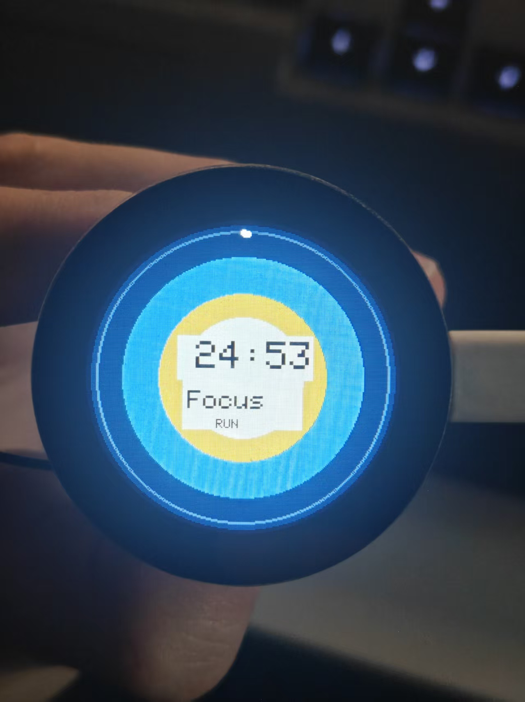
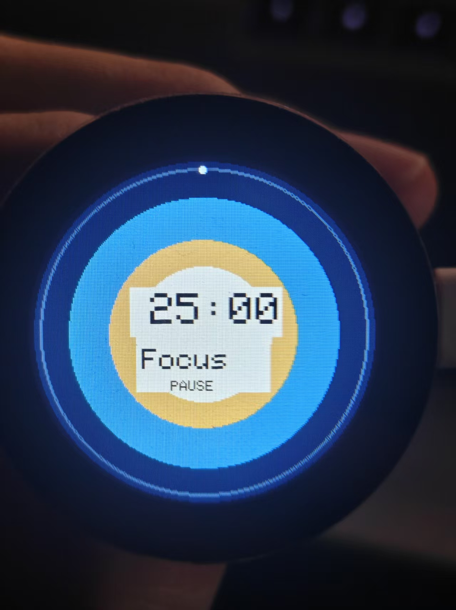
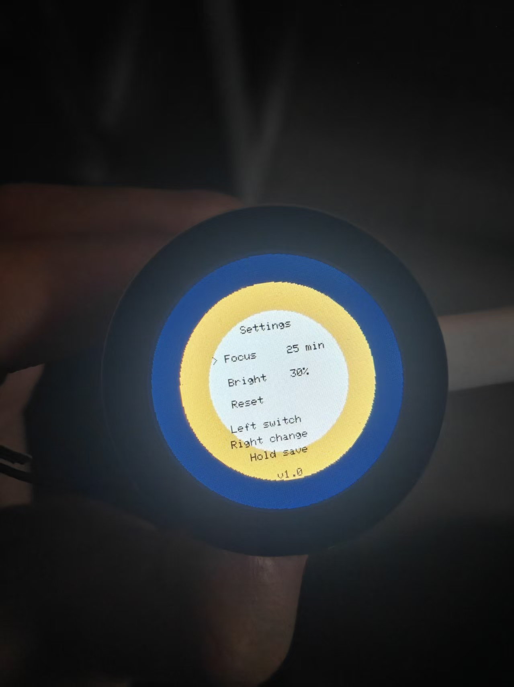
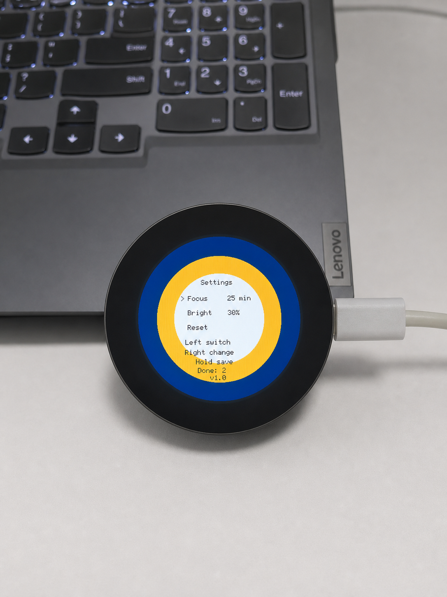
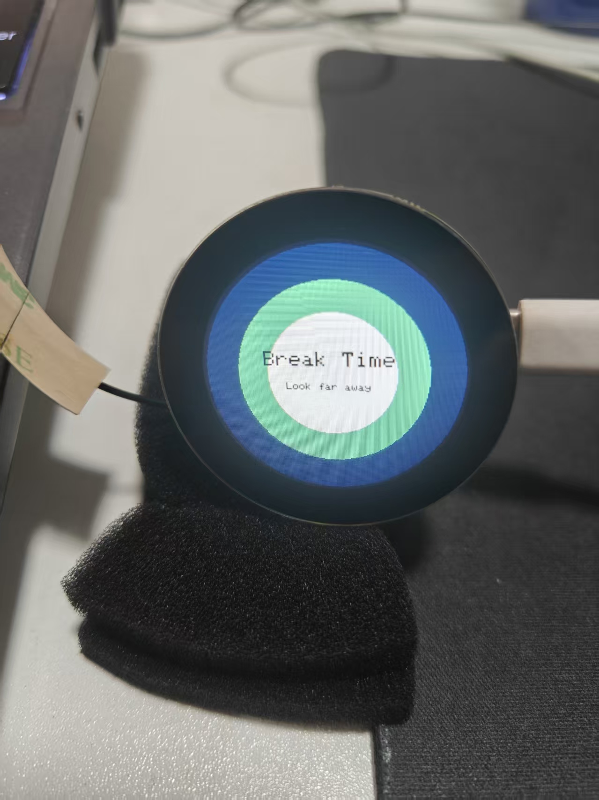
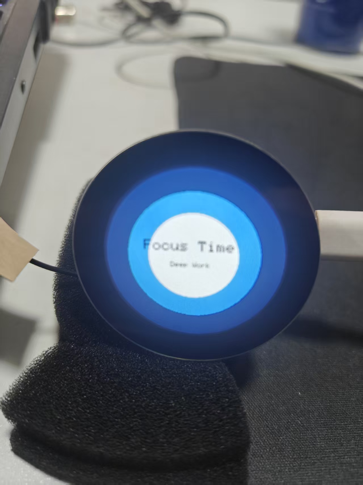
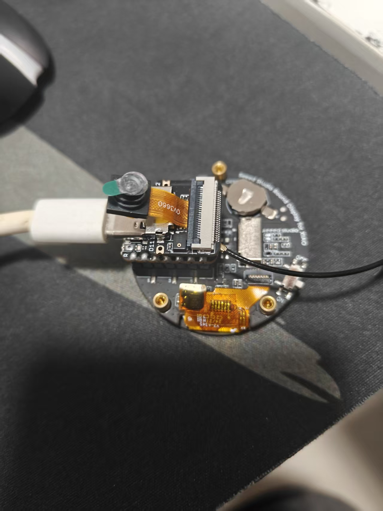

# XIAO Pomodoro Companion

A small Pomodoro desk companion built with a Seeed Studio XIAO ESP32S3 Sense and the Seeed Round Display for XIAO.

The project focuses on a stable embedded workflow first: PlatformIO, Arduino framework, round LCD rendering, touch input, persistent settings, and a simple product-like interaction model.

## Hardware

* Seeed Studio XIAO ESP32S3 Sense
* Seeed Studio Round Display for XIAO
* USB-C data cable
* External 2.4 GHz antenna connected to the XIAO ESP32S3 U.FL/IPEX connector

Current development setup does not require a battery, TF card, or RTC coin cell.

## Hardware Notes

The XIAO ESP32S3 Sense is not just a basic ESP32S3 board. The Sense expansion board also includes an onboard camera, a PDM digital microphone, and microSD-related circuitry. These onboard features reserve or share several GPIO pins, so future hardware expansion should be planned carefully.

### Currently Used in This Project

This firmware currently uses:

* Round display
* Touch input from the Round Display
* ESP32 internal NVS storage for settings
* USB-C for power, upload, and serial debugging

This firmware currently does **not** use:

* Camera
* PDM microphone
* microSD card
* External battery
* RTC coin cell
* JTAG debugging

Pomodoro settings such as focus duration and brightness are stored in **ESP32 NVS**, not on a microSD card.

### Microphone Pins

The onboard PDM digital microphone uses:

| Function |   GPIO |
| -------- | -----: |
| PDM DATA | GPIO41 |
| PDM CLK  | GPIO42 |

These pins are also exposed as D12 / D11 on the Sense expansion board, but they are reserved for the onboard microphone by default.

Do not use GPIO41 / GPIO42 for other peripherals unless the microphone is intentionally disabled.

Also note that GPIO41 and GPIO42 should not be treated as ADC-capable analog input pins, even if they appear near analog-style labels in some diagrams.

### Camera Pins

The Sense camera uses several GPIO pins:

| Camera Signal |   GPIO |
| ------------- | -----: |
| XMCLK         | GPIO10 |
| DVP_Y8        | GPIO11 |
| DVP_Y7        | GPIO12 |
| DVP_PCLK      | GPIO13 |
| DVP_Y6        | GPIO14 |
| DVP_Y2        | GPIO15 |
| DVP_Y5        | GPIO16 |
| DVP_Y3        | GPIO17 |
| DVP_Y4        | GPIO18 |
| DVP_VSYNC     | GPIO38 |
| Camera SCL    | GPIO39 |
| Camera SDA    | GPIO40 |
| DVP_HREF      | GPIO47 |
| DVP_Y9        | GPIO48 |

This project does not currently use the camera, but these pins should be considered reserved if camera support is added later.

### microSD / SPI Pin Sharing

The Sense expansion board includes microSD-related circuitry that shares SPI-related pins:

| Function   |   GPIO |
| ---------- | -----: |
| microSD CS | GPIO21 |
| SPI SCK    |  GPIO7 |
| SPI MISO   |  GPIO8 |
| SPI MOSI   |  GPIO9 |

The Round Display also depends on display/touch communication, so avoid changing SPI-related hardware configuration unless the full pin map is reviewed.

This project does not currently use the Sense microSD slot.

### Do Not Cut J1 / J2 / J3 for This Project

The Sense board exposes solder jumpers such as J1, J2, and J3 for advanced hardware configuration.

For this project, do **not** cut or modify these jumpers.

* J1 / J2 are related to the microphone connection on GPIO41 / GPIO42.
* J3 is related to the Sense board's microSD / SPI configuration.
* Cutting these jumpers can disable onboard functions or create hard-to-debug hardware issues.

This project keeps the Sense hardware in its default state.

### Expansion Guidelines

For future expansion:

* Prefer I2C / Grove-style peripherals when possible.
* Avoid GPIO41 / GPIO42 if microphone support may be used later.
* Avoid modifying D8 / D9 / D10 / GPIO21 unless microSD and SPI sharing are fully understood.
* Do not cut J1 / J2 / J3 unless the hardware modification is intentional and documented.
* Keep camera, microphone, and microSD support as separate experimental milestones.

Suggested future milestones:

* `v1.1-microphone-test`: read PDM microphone audio level and display Quiet / Loud.
* `v1.2-camera-test`: validate camera capture independently.
* `v1.3-hardware-feedback`: add buzzer or vibration motor.
* `v1.4-battery-power`: add LiPo battery support and power management.

## Features

* Pomodoro timer with Focus and Break sessions
* Automatic Focus / Break switching
* Round progress ring
* Touch controls
* Settings menu
* Idle screen after paused inactivity
* Completed Focus session counter
* Focus duration setting: 25 / 45 / 50 minutes
* Brightness setting: 30 / 60 / 100 percent
* Reset menu item
* Stats reset item
* NVS persisted settings
* Wellness prompts when entering Break
* Session transition feedback
* Settings screen version display

## Gallery

| Focus running | Focus paused | Settings |
| --- | --- | --- |
|  |  |  |

| Session stats | Break prompt | Focus transition |
| --- | --- | --- |
|  |  |  |

| Hardware |
| --- |
|  |

## Interaction

### Normal Screen

| Action     | Result                       |
| ---------- | ---------------------------- |
| Short tap  | Start / pause / resume timer |
| Long press | Enter Settings               |

### Settings Screen

| Action                   | Result                                         |
| ------------------------ | ---------------------------------------------- |
| Left-half tap            | Switch item: Focus / Bright / Reset / Stats    |
| Right-half tap on Focus  | Cycle 25 / 45 / 50 minutes                     |
| Right-half tap on Bright | Cycle 30 / 60 / 100 percent                    |
| Right-half tap on Reset  | Reset Pomodoro and return to the normal screen |
| Right-half tap on Stats  | Clear completed Focus counter                  |
| Long press               | Save settings and exit                         |

## Settings

Settings are saved with ESP32 Preferences / NVS.

* `focus_minutes`: 25 / 45 / 50
* `break_minutes`: currently fixed at 5
* `brightness_percent`: 30 / 60 / 100

Saved settings are restored after power loss or USB reconnect.

## Development Environment

* Windows
* VS Code
* PlatformIO IDE
* PlatformIO Core 6.1.19
* Arduino framework
* Board: `seeed_xiao_esp32s3`

## Build, Upload, Monitor

From the project root:

```powershell
& "$env:USERPROFILE\.platformio\penv\Scripts\platformio.exe" run
```

Upload:

```powershell
& "$env:USERPROFILE\.platformio\penv\Scripts\platformio.exe" run -t upload
```

Monitor:

```powershell
& "$env:USERPROFILE\.platformio\penv\Scripts\platformio.exe" device monitor
```

This project currently uses `COM11` in `platformio.ini`.

## Project Structure

```text
src/
+-- main.cpp              # setup and loop orchestration
+-- app_state.h/.cpp      # Pomodoro state
+-- pomodoro_timer.h/.cpp # timer logic
+-- input.h/.cpp          # touch events
+-- ui.h/.cpp             # display rendering
+-- config.h/.cpp         # NVS-backed settings
+-- prompts.h/.cpp        # break wellness prompts
+-- version.h             # app version string
+-- driver.h              # display driver reference/config
```

## Version Milestones

| Tag                        | Summary                                         |
| -------------------------- | ----------------------------------------------- |
| `v0.1-baseline`            | First working PlatformIO / display baseline     |
| `v0.2-stable-touch`        | Touch, reset, and partial refresh stabilization |
| `v0.3-modular`             | Modular source structure                        |
| `v0.4-session-feedback`    | Focus / Break transition feedback               |
| `v0.5-settings-nvs`        | Persistent configuration layer                  |
| `v0.6-settings-ui`         | Focus duration settings UI                      |
| `v0.7-brightness-settings` | Brightness configuration and settings UI        |
| `v0.8-wellness-prompts`    | Break wellness prompts                          |
| `v0.9-settings-reset-item` | Reset item in Settings                          |
| `v1.0-polish`              | README, gallery, hardware notes, and v1.0 UI version display |
| `v1.1-idle-screen`         | Idle screen for paused inactivity               |
| `v1.2-session-stats`       | Completed Focus session counter                 |
| `v1.3-stats-reset`         | Clear completed Focus counter from Settings     |

## Next Steps

* Consider hardware feedback with a buzzer or vibration motor
* Explore battery and power management
* Explore microphone-based ambient sensing as a separate experiment
